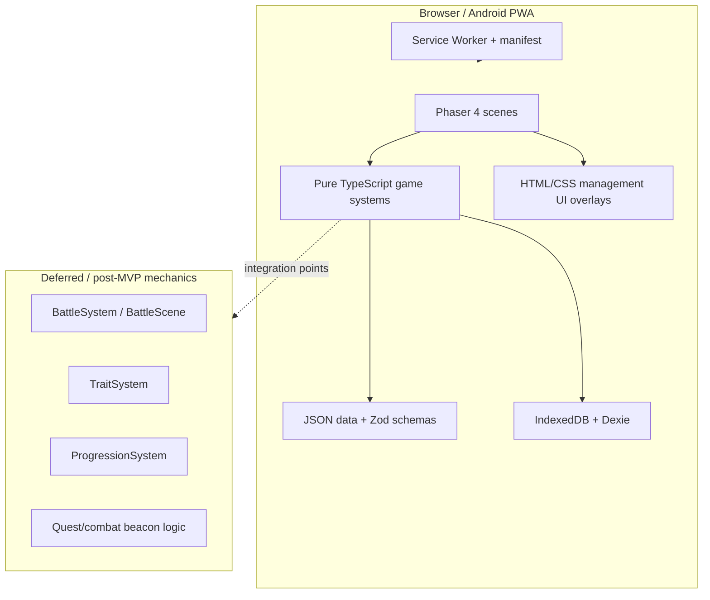

# Architecture

## Position after Claude review

Claude's research pack is useful as a reference, but it is not the architecture authority. The accepted project architecture is:

- **Phaser 4 + TypeScript + Vite** for browser-first development.
- **PWA-first delivery**, then **TWA** if Google Play distribution is needed.
- **Capacitor is deferred** and only considered if native APIs become necessary.
- **IndexedDB via Dexie.js** for save data.
- **Data-driven gameplay**: crew, missions, events, ship systems, and resources are defined in data files and validated with Zod.

Claude proposals accepted:

- `scenes/`, `systems/`, `data/`, `types/`, `ui/`, `storage/`, `utils/` separation.
- Scenes orchestrate rendering and input; systems own business logic.
- Event definitions as JSON with weighted choices and requirements.
- `weightedPick` as a small tested utility.
- UI overlays for management screens where HTML/CSS is more accessible than canvas-only UI.
- Scope-control docs: `SCOPE.md`, `IDEAS_LATER.md`, and ADRs.
- Code review prompt focused on high-signal issues only.

Claude proposals rejected or modified:

- **Rejected:** "Phaser 3 only / no Phaser 4". The approved architecture stays on Phaser 4.
- **Rejected:** `idb-keyval` as the main save abstraction. Dexie.js remains approved because schema versioning and migrations matter for long-running save files.
- **Modified:** "No Capacitor ever" becomes "no Capacitor for MVP; consider only for native APIs post-MVP."
- **Deferred after mechanika v1.0:** battle implementation, full trait-effect expansion, combat/quest beacon logic, faction systems, and any rules explicitly marked open or post-MVP in `mechanika/`.

## Target project structure

```text
SpaceshipGame/
├── .github/
│   ├── copilot-instructions.md
│   ├── instructions/
│   │   ├── phaser.instructions.md
│   │   ├── data-driven.instructions.md
│   │   └── mobile-ux.instructions.md
│   ├── prompts/
│   │   ├── game-dev.prompt.md
│   │   ├── skills-adoption.prompt.md
│   │   ├── game-brief.prompt.md
│   │   ├── fabula.prompt.md
│   │   ├── gdd.prompt.md
│   │   ├── investigate.prompt.md
│   │   ├── new-scene.prompt.md
│   │   ├── new-system.prompt.md
│   │   ├── new-event.prompt.md
│   │   ├── data-schema.prompt.md
│   │   ├── pwa-check.prompt.md
│   │   ├── mobile-ux.prompt.md
│   │   └── code-review.prompt.md
│   ├── agents/
│   │   ├── game-planner.agent.md
│   │   ├── game-architect.agent.md
│   │   └── game-reviewer.agent.md
│   └── skills/
│       ├── scaffold-scene/
│       │   └── SKILL.md
│       ├── scaffold-system/
│       │   └── SKILL.md
│       ├── mechanika-spec/
│       │   └── SKILL.md
│       ├── story-bible/
│       │   └── SKILL.md
│       ├── skill-creator/
│       │   └── SKILL.md
│       ├── content-research-writer/
│       │   └── SKILL.md
│       ├── incoming/
│       │   └── README.md
│       └── README.md
├── public/
│   ├── manifest.json
│   └── assets/
├── src/
│   ├── main.ts
│   ├── data/
│   │   ├── schemas/
│   │   ├── crew.json
│   │   ├── missions.json
│   │   ├── events.json
│   │   ├── ship-systems.json
│   │   └── resources.json
│   ├── models/
│   ├── scenes/
│   ├── systems/
│   ├── storage/
│   ├── ui/
│   ├── types/
│   └── utils/
├── docs/
│   ├── GAME_BRIEF.md
│   ├── FABULA.md
│   └── GDD.md
├── mechanika/
└── claude_tips/
```

## Source of truth order

Custom Copilot slash commands come from each prompt file `name:` field, so the active commands are `/game-dev`, `/game-brief`, `/fabula`, `/gdd`, `/skills-adoption`, `/investigate`, `/new-scene`, `/new-system`, `/new-event`, `/data-schema`, `/pwa-check`, `/mobile-ux`, and `/code-review`.

When documents overlap, resolve conflicts in this order:

1. `mechanika/` for final gameplay mechanics.
2. `docs/FABULA.md` for narrative canon and story direction.
3. `docs/SCOPE.md` for MVP boundaries and post-MVP exclusions.
4. `docs/ADRs/` for accepted technical decisions.
5. `docs/ARCHITECTURE.md` for project structure and system boundaries.
6. `.github/copilot-instructions.md` for day-to-day Copilot behavior.
7. `claude_tips/`, `dodatki/research/`, and `dodatki/skills/` as reference material only; they are not authoritative.

## Core systems

| System | MVP responsibility | Notes |
|---|---|---|
| `ShipSystem` | Ship hull/status/system health | Must cover the approved system list from `mechanika/05-ship-systems.md`; combat remains deferred. |
| `CrewSystem` | Crew roster, assignments, health/morale/fatigue/radiation clamps | Implements torpor rotation, relation flags, and approved trait hooks from `mechanika/04-crew.md`. |
| `MissionSystem` | Active mission state, mission steps, completion | Must support 14 approved missions, including multi-turn missions. |
| `ResourceSystem` | Oxygen, water, food, fuel, parts, and system-driven deltas | Every resource needs an input, output, and shortage consequence. |
| `EventSystem` | Weighted random event selection and choice resolution | Must support forced events, weighted events, blue options, and approved failure/death outcomes. |
| `LifeSearchSystem` | LifeData, discovery progress, and ending flags | MVP covers the approved discovery scale and mission/event dependencies only. |
| `SaveSystem` | Dexie save/load/autosave/schema versioning | Must preserve active run state plus logbook retention after permadeath. |

## Event model

Events should be data-driven and compatible with FTL-like "blue options":

```json
{
  "id": "abandoned_station_01",
  "title": "Opuszczona stacja",
  "weight": 5,
  "requirements": { "minFuel": 1 },
  "choices": [
    {
      "id": "investigate",
      "text": "Zbadaj wnętrze",
      "requires": { "crewSkill": "engineering", "minValue": 3 },
      "outcomes": [
        { "weight": 70, "text": "Znaleziono części.", "effects": [{ "resource": "parts", "delta": 3 }] },
        { "weight": 30, "text": "Wypadek przy eksploracji.", "effects": [{ "crewHealth", "delta": -1 }] }
      ]
    }
  ]
}
```

Combat remains reserved. Death, permadeath, and ending behavior should now follow `mechanika/09-failure-and-game-over.md`.

## Mechanics integration points

The following still require partial or deferred treatment even after `mechanika/` v1.0:

| Integration point | Allowed now | Not allowed yet |
|---|---|---|
| `BattleScene` | Stub with TODO | Combat implementation |
| `BattleSystem` | Stub with interface only | Damage formulas, enemy AI |
| `TraitSystem` | Serializable trait identifiers and only approved effects | Broad trait-effect design beyond approved spec |
| `ProgressionSystem` | Captain voices, crew micro-growth, discovery progression | Broad XP trees and level-up rules |
| `BeaconType.combat` | Enum value as reserved | Combat encounters |
| `BeaconType.quest` | Enum value as reserved | Quest chains |
| Morale | Numeric field, thresholds, and approved event hooks | Additional simulation outside `mechanika/` |

## Mermaid overview



## Narrative foundation with mechanics locked

Now that `mechanika/` is filled, the repository uses it as the gameplay source of truth, while `docs/FABULA.md` remains the canon source for story and `docs/GAME_BRIEF.md` keeps the product frame concise. `docs/GDD.md` should track implementation order, blockers, and scope decisions instead of duplicating full mechanics tables. Additional skill packages should still be staged in `.github/skills/incoming/` before they become active local skills.
